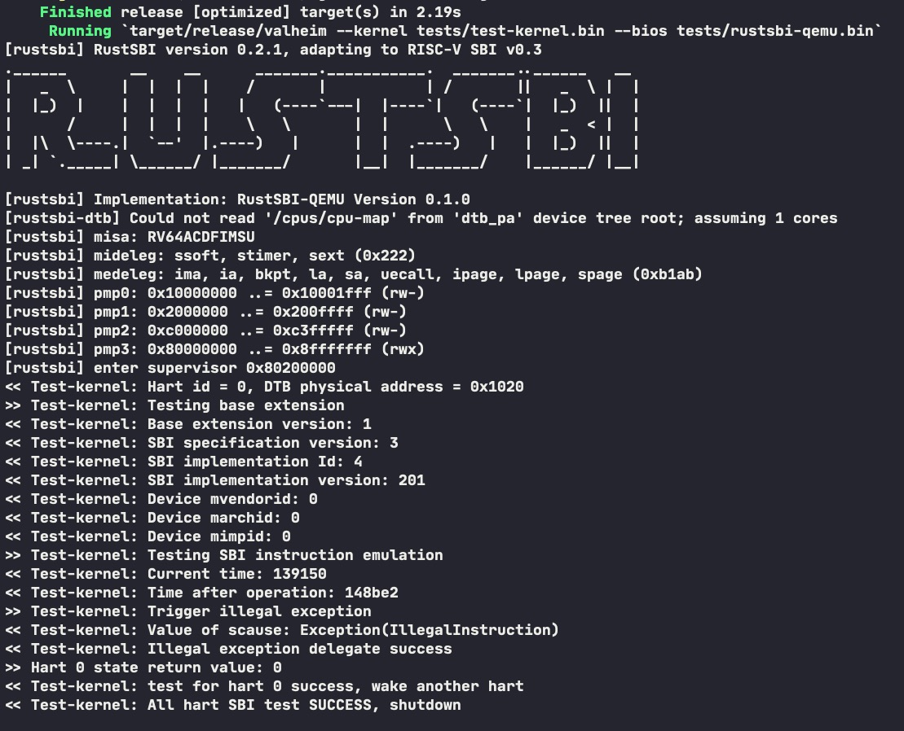
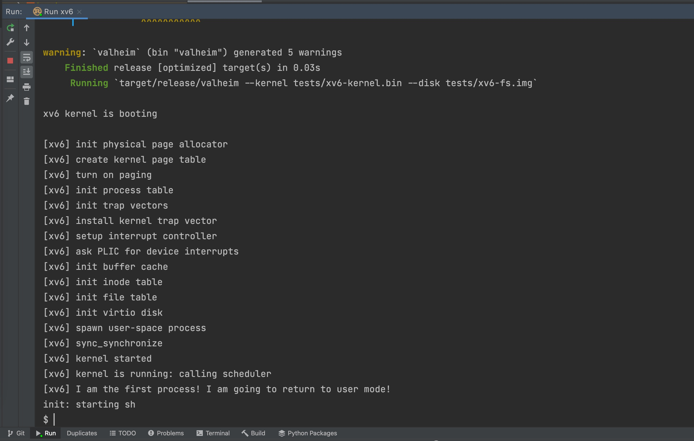

# valheim
Learning purpose riscv64 (RV64GC) emulator.
This project is built for [一生一芯](https://ysyx.org/) as a reference implementation.

### Highlights
- [Type-safe instructions](./valheim-core/src/isa/typed.rs) which makes the decoding [less error-prone](./valheim-core/src/isa/decode.rs).
- Full emulation trace (registers, memory, etc.) like persistent data structures, which is useful for debugging the real hardware.
- [MISA]() = `RV64ACDFIMSU`
  - RV64G (IMAFD_Zicsr_Zifencei) instruction set
  - RVC extension
  - Supervisor mode extension
  - User mode extension

### Amazing Moments

#### Running [openEuler Linux for RISC-V](https://github.com/openeuler-mirror/RISC-V)

Currently, the `init` program cannot use serial device as console (I am trying hard to find the cause).
But the kernel was indeed __successfully booted and initialized__.

I was thinking that should I just give up trying to fix the console problem, instead,
go and implement a `virtio-net` device and start the `sshd` service when booted? 
It's not that hard comparingly, and it's closer to the real-world use case.

[](https://asciinema.org/a/481577)

#### Running [RustSBI-QEMU with its test kernel](https://github.com/rustsbi/rustsbi-qemu)
With the following command:
```shell
cargo run --release -- --kernel tests/test-kernel.bin --bios tests/rustsbi-qemu.bin
```



#### Running [xv6 for RISC-V](https://github.com/mit-pdos/xv6-riscv)
With the following command:
```shell
$(CROSS)objcopy -O binary xv6/kernel xv6/kernel.bin
cargo run --release -- --kernel xv6/kernel.bin --disk xv6/fs.img
```



### Why not using [nemu](https://github.com/NJU-ProjectN/nemu) that was recommended by [一生一芯](https://ysyx.org/) project?

Their Project-N was great, and it is definitely a good study material for students who have less code experience before.
I feel envy at NJU students having such a great project and a great community (all teachers, TAs and RAs).

One thing I can remember was that, the nemu can somehow (through some config macros) depend on the abstract-machine 
(which is actually an operating system). How can an emulator depend on a specific operating system? It's ridiculous. 
It is only meaningful to take it as programming exercises for those less-code-experienced students. 

Unfortunately and apparently, I am not its target audience --- I am not the one who need extra programming exercise, 
instead I code a lot, and I have my own project management style. Their project just does not fit my taste.
