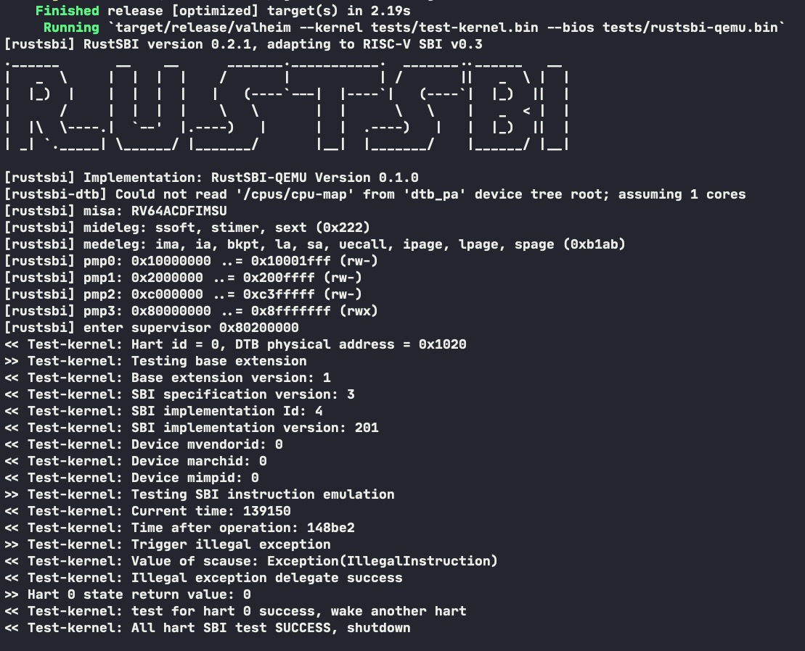
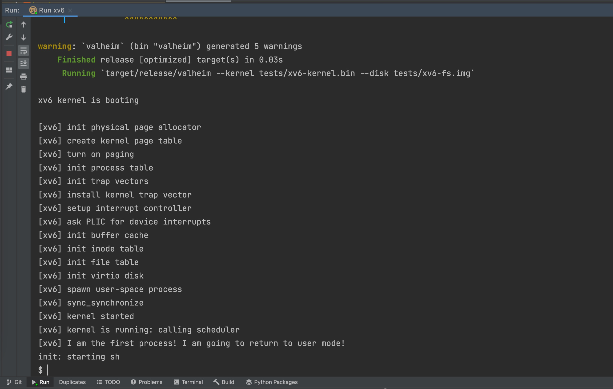

# valheim
Learning purpose riscv64 (RV64GC) emulator.
This project is built for [一生一芯](https://ysyx.org/) as a reference implementation.

### Runnable demos

The repository contains three reproducible launchers. Run them from the repository root:

```shell
./demo/xv6/run.sh
./demo/rustsbi/run.sh
./demo/linux/run.sh
```

All three launchers default to the JIT engine; pass `--engine naive` to select the reference
interpreter explicitly.

Guest networking is opt-in. The Linux demo can use an isolated, unprivileged `passt` process for
IPv4 outbound NAT; networking remains disabled when `--net nat` is absent:

```shell
./demo/linux/run.sh --net nat
./demo/linux/run.sh --net nat --net-subnet 10.173.0.0/16
```

The default subnet is `10.172.0.0/16` (guest `.15`, gateway `.2`, DNS `.3`). The current backend
does not provide IPv6, host-to-guest connections, or inbound port forwarding.

The virtual platform also exposes the QEMU `virt` Goldfish RTC at `0x00101000` on PLIC IRQ 11.
It follows the host wall clock, so a Linux guest with the built-in Goldfish driver initializes
`CLOCK_REALTIME` through `rtc0`/HCTOSYS during boot without depending on guest networking or NTP.

The first run downloads the pinned guest sources and toolchains. All downloaded and generated
files are kept under `target/demo/`; only the minimal static inputs under `demo/` are
tracked by Git. See each demo's README and [AGENTS.md](AGENTS.md) for prerequisites, pinned
versions, and expected output.

### Highlights

- [Type-safe instructions](valheim-asm/src/isa/typed.rs) which makes the decoding [less error-prone](valheim-asm/src/isa/decode.rs).
- Full emulation trace (registers, memory, etc.) like persistent data structures, which is useful for debugging the real hardware.
- Legacy VirtIO-MMIO block and network devices, including opt-in IPv4 outbound NAT through a
  replaceable host-network backend.
- QEMU-compatible Goldfish RTC with host wall-clock time, guest time setting, alarms, and
  level-triggered PLIC delivery that can wake an idle hart without busy polling.
- [MISA]() = `RV64ACDFIMSU`
  - RV64G (IMAFD_Zicsr_Zifencei) instruction set
  - RVC extension
  - Supervisor mode extension
  - User mode extension

### Amazing Moments

#### Running [openEuler Linux for RISC-V](https://github.com/openeuler-mirror/RISC-V)

At the time of this historical recording, the `init` program could not use the serial device as its
console, although the kernel had __successfully booted and initialized__. The original note wondered
whether to implement `virtio-net` and use SSH instead. Valheim now has a legacy VirtIO network
device and opt-in outbound NAT, while inbound SSH/port forwarding remains outside the current
networking scope.

[](https://asciinema.org/a/481577)

#### Running [RustSBI-QEMU with its test kernel](https://github.com/rustsbi/rustsbi-qemu)
With the following command:
```shell
./demo/rustsbi/run.sh
```



#### Running [xv6 for RISC-V](https://github.com/mit-pdos/xv6-riscv)
With the following command:
```shell
./demo/xv6/run.sh
```



<!--
### Why not using [nemu](https://github.com/NJU-ProjectN/nemu) that was recommended by [一生一芯](https://ysyx.org/) project?

Their Project-N was great, and it is definitely a good study material for students who have less code experience before.
I feel envy at NJU students having such a great project and a great community (all teachers, TAs and RAs).

One thing I can remember was that, the nemu can somehow (through some config macros) depend on the abstract-machine 
(which is actually an operating system). How can an emulator depend on a specific operating system? It's ridiculous. 
It is only meaningful to take it as programming exercises for those less-code-experienced students. 

Unfortunately and apparently, I am not its target audience --- I am not the one who need extra programming exercise, 
instead I code a lot, and I have my own project management style. Their project just does not fit my taste.
-->
